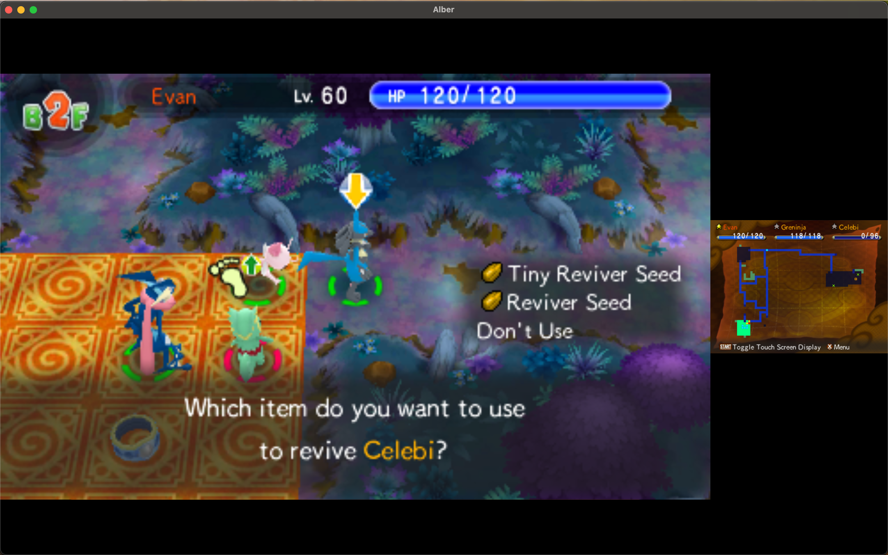

# Panda3DS
[](https://github.com/wheremyfoodat/Panda3DS/actions/workflows/Windows_Build.yml) [](https://github.com/wheremyfoodat/Panda3DS/actions/workflows/MacOS_Build.yml) [](https://github.com/wheremyfoodat/Panda3DS/actions/workflows/Linux_Build.yml) [](https://aur.archlinux.org/packages/panda3ds-git)

Panda3DS is an HLE, red-panda-themed Nintendo 3DS emulator written in C++ which started out as a fun project out of curiosity, but evolved into something that can sort of play games!

Experimenting with new methods in emulation and unique features such as Lua scripting, we're here to make a difference!

# Discussion
Join our Discord server by pressing on the banner below, or find us on other platforms via [our website](https://panda3ds.com/)!

[](https://discord.gg/ZYbugsEmsw)

  

# Download
You can download stable builds from the Releases tab, or you can download the latest build from the table below

|Platform|Status|Download|
|--------|------------|--------|
|Windows build|[](https://github.com/wheremyfoodat/Panda3DS/actions/workflows/Windows_Build.yml)|[Windows Executable](https://nightly.link/wheremyfoodat/Panda3DS/workflows/Windows_Build/master/Windows%20executable.zip)|
|MacOS build|[](https://github.com/wheremyfoodat/Panda3DS/actions/workflows/MacOS_Build.yml)|[MacOS App Bundle](https://nightly.link/wheremyfoodat/Panda3DS/workflows/MacOS_Build/master/MacOS%20Alber%20App%20Bundle.zip)|
|Linux build|[](https://github.com/wheremyfoodat/Panda3DS/actions/workflows/Linux_Build.yml)|[Linux AppImage](https://nightly.link/wheremyfoodat/Panda3DS/workflows/Linux_AppImage_Build/master/Linux%20executable.zip)|

# Compatibility
Panda3DS is still in the early stages of development. Many games boot, many don't. Lots of games have at least some hilariously broken graphics, audio is not supported, and some QoL features (including a GUI) are missing. However, even more things are implemented, such as most of the 3DS core required to play games, and various neat features, such as Lua scripting, discord bot support, support for some system apps, cheats, controller support, WIP amiibo support and many more! The emulator is constantly evolving, so make sure to take a peek every now and then!

For documenting game compatibility, make sure to visit the [games list repository](https://github.com/Panda3DS-emu/Panda3DS-Games-List). For miscellaneous issues or more technical issues, feel free to use this repo's issues tab.
# Why?
The 3DS emulation scene is already pretty mature, with offerings such as [Citra](https://github.com/citra-emu/citra) which can offer a great playing experience for most games in the library, [Corgi3DS](https://github.com/PSI-Rockin/Corgi3DS), an innovative LLE emulator, or [Mikage](https://mikage.app/). However, there's always room for more emulators! While Panda3DS was initially a mere curiosity, there's many different concepts I would like to explore with it in the future, such as:

- Virtualization. What motivated the creation of this emulator was actually a discussion on whether it is possible to get fast 3DS emulation on low-end hardware such as the Raspberry Pi 4, using the KVM API. At the moment, Panda3DS is powered by Dynarmic rather than using virtualization, but this is definitely a concept I want to explore in the future.

- Debugging, reverse engineering and modding tools. While contributing to [PCSX-Redux](https://github.com/grumpycoders/pcsx-redux) and collaborating with the other developers, I had the chance to find out how useful tools like these can be. They can serve as indispensable tools for the homebrew devs, modders, reverse engineers, as well as emulator developers themselves. Some tools can even become fun toys the casual user can mess around with. As such, I think they can really improve the experience in a project like this. Of course, I'd like to thank @nicolasnoble and the entire Redux team for helping me learn the value of these tools, as well as making me improve as a programmer.

- Trying out various other unique features, such as different graphics or audio enhancements, or supporting other niche things such as amiibo.

- Fun. Writing code is fun and I strongly encourage anyone to do it.

Keep in mind, these are all long-term plans. Until then, the main focus is just improving compatibility

# How to build
Panda3DS compiles on Windows, Linux and MacOS, with only 1 (optional) system dependency, the Vulkan SDK. If you don't want to install the Vulkan SDK you can always build the emulator with only OpenGL support, by adding `-DENABLE_VULKAN=OFF` to the `cmake` command

All you need is CMake and a generator of your choice (Make, Visual Studio, Ninja, etc). Simply clone the repo recursively and build it like your average CMake project.

```sh
git clone https://github.com/wheremyfoodat/Panda3DS --recursive

cd Panda3DS && mkdir build && cd build
cmake .. -DCMAKE_BUILD_TYPE=Release -DENABLE_USER_BUILD=ON  # Set up compilers etc here if you'd like

<Invoke Make, Visual Studio, or whatever you would like to use>
```

\*If you want to contribute to the project, you may not want to enable the ENABLE_USER_BUILD option and instead familiarize yourself with the various CMake options provided in the root CMakeLists.txt

# How to use
Simply drag and drop a ROM to the executable if supported, or invoke the executable from the command line with the path to the ROM as the first argument like: `Alber.exe MyGame.3ds`
<br>
Panda3DS can load ROMs in the following formats:
- .3ds/.cci
- .cxi/.app
- .elf/.axf
- .3dsx

Both decrypted and encrypted dumps are supported. However for encrypted dumps you must provide your AES keys file by adding a `sysdata` folder to the emulator's app data directory with a file called `aes_keys.txt` including your keys. Currently .cia files are not supported yet (support is planned for the future), however if you want you can usually use Citra to extract the .app/.cxi file out of your .cia and run that.

## Controls
Keyboard & Mouse
- Up button	W
- Down button	S
- Left button	A
- Right button	D
- A button	L
- B button	K
- X button	O
- Y button	I
- L button	Q
- R button	P
- Start button	Enter
- Select button	Backspace
- Touch Screen  Left click
- Gyroscope     Hold right click and swipe your mouse left and right (support is kind of shaky atm, but games that require gyro here and there like Kirby should work)
- Pause/Resume  F4
- Reload        F5


Panda3DS also supports controller input using the SDL2 GameController API.

# Acknowledgements
- [3DBrew](https://www.3dbrew.org/wiki/Main_Page), a wiki full of 3DS information and the main source of documentation used.
- [GBATek](https://www.problemkaputt.de/gbatek.htm#3dsreference), a GBA, DS and 3DS reference which provided insights on some pieces of hardware as well as neatly documenting things like certain file formats used in games.
- [Libctru](https://github.com/devkitPro/libctru), the most well-known 3DS homebrew SDK. Used for developing test ROMs, as well as a source of documentation thanks to its doxygen wiki.
- [ctru-rs](https://github.com/rust3ds/ctru-rs), a wrapper around libctru for writing 3DS homebrew in Rust.

- [Citra](https://github.com/citra-emu/citra), an HLE 3DS emulator. Very useful as a reference, with some code snippets inspired or adapted from it.
- [3dmoo](https://github.com/plutooo/3dmoo), an HLE 3DS emulator which helped similarly to Citra
- [Corgi3DS](https://github.com/PSI-Rockin/Corgi3DS), an LLE 3DS emulator which both served as an inspiration, as well as a nice source of documentation for some PICA200-related things

# Sister Projects
- [Dynarmic](https://github.com/merryhime/dynarmic): An arm32/arm64 to x86-64/ARMv8 recompiler
- [PCSX-Redux](https://github.com/grumpycoders/pcsx-redux): A PlayStation 1 emulator targetting developers, reverse engineers and regular PS1 fans alike
- [SkyEmu](https://github.com/skylersaleh/SkyEmu): A seagull-themed low-level GameBoy, GameBoy Color, GameBoy Advance and Nintendo DS emulator that is designed to be easy to use, cross platform and accurate.
- [NanoBoyAdvance](https://github.com/nba-emu/NanoBoyAdvance): A Game Boy Advance emulator focusing on hardware research and cycle-accurate emulation
- [Dust](https://github.com/kelpsyberry/dust): Nintendo DS emulator for desktop devices and the web
- [MelonDS](https://github.com/melonDS-emu/melonDS): "DS emulator, sorta" - Arisotura
- [Kaizen](https://github.com/SimoneN64/Kaizen): Experimental work-in-progress low-level N64 emulator
- [ChonkyStation](https://github.com/liuk7071/ChonkyStation): Work-in-progress PlayStation emulator
- [shadPS4](https://github.com/georgemoralis/shadPS4): Work-in-progress PS4 emulator by the founder of PCSX, PCSX2 and more
- [Hydra](https://github.com/hydra-emu/hydra): Cross-platform GameBoy, NES, N64 and Chip-8 emulator

# Support
If you find this project exciting and want to support the founder, check out [his Patreon](https://www.patreon.com/wheremyfoodat) or [Ko-fi](https://ko-fi.com/wheremyfoodat)
<br>
Keep in mind that funding is only aimed to cover various life costs and support development. Panda3DS is a free product and on no occasion will official builds ever be made private or limited to sponsors! Any donation is much appreciated!

Nintendo 3DS is a registered trademark of Nintendo Co., Ltd.


Here's a panda it go blep
